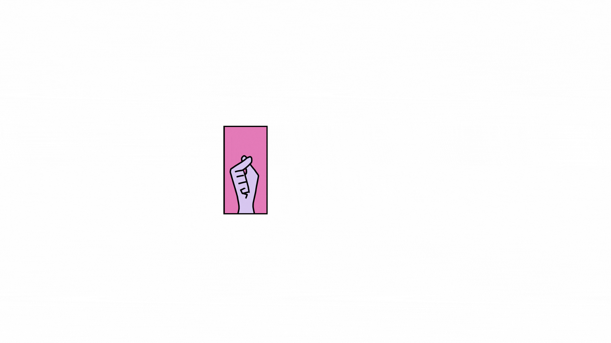
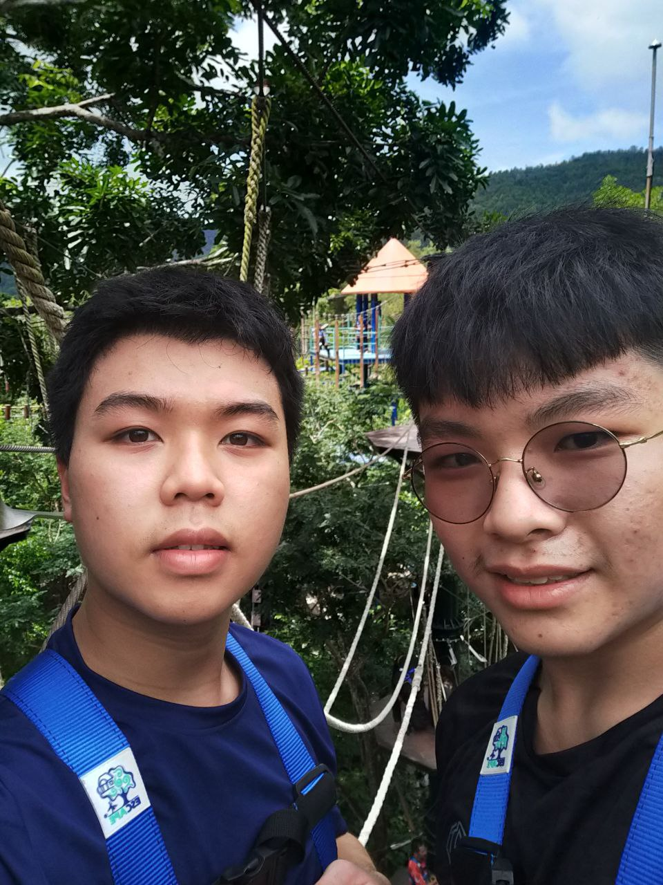

[](https://zhiming.tan/)


<!--
**ZHIMING04/ZHIMNG04** is a ✨ _special_ ✨ repository because its `README.md` (this file) appears on your GitHub profile.

Here are some ideas to get you started:

- 🔭 I’m currently working on ...
- 🌱 I’m currently learning ...
- 👯 I’m looking to collaborate on ...
- 🤔 I’m looking for help with ...
- 💬 Ask me about ...
- 📫 How to reach me: ...
- 😄 Pronouns: ...
- ⚡ Fun fact: ...
-->
<!--
<table>
	<tr>
	</tr>
	<tr>
		<th>
			<h2><code>𝚂𝚙𝚎𝚌𝚒𝚊𝚕</code>: 𝙸'𝚖 𝚙𝚊𝚛𝚝𝚒𝚌𝚒𝚙𝚊𝚝𝚒𝚗𝚐 𝚒𝚗 𝙷𝚊𝚌𝚔𝚝𝚘𝚋𝚎𝚛𝚏𝚎𝚜𝚝!</h2>
			𝙰𝚗𝚢𝚘𝚗𝚎 𝚠𝚑𝚘 𝚠𝚊𝚗𝚝𝚜 𝚝𝚘 𝚒𝚜 𝚠𝚎𝚕𝚌𝚘𝚖𝚎 𝚝𝚘 𝚙𝚊𝚛𝚝𝚒𝚌𝚒𝚙𝚊𝚝𝚎! 𝙹𝚞𝚜𝚝 𝚜𝚒𝚐𝚗 𝚞𝚙 𝚊𝚝 <a href="https://hacktoberfest.digitalocean.com/">𝚑𝚝𝚝𝚙𝚜://𝚑𝚊𝚌𝚔𝚝𝚘𝚋𝚎𝚛𝚏𝚎𝚜𝚝.𝚍𝚒𝚐𝚒𝚝𝚊𝚕𝚘𝚌𝚎𝚊𝚗.𝚌𝚘𝚖/</a>.
				<br>𝙱𝚊𝚜𝚒𝚌𝚊𝚕𝚕𝚢, 𝚖𝚊𝚔𝚎 𝟺 𝙿𝚁𝚜 𝚝𝚘 𝙶𝚒𝚝𝙷𝚞𝚋 𝚛𝚎𝚙𝚘𝚜 𝚊𝚗𝚍 𝚐𝚎𝚝 𝚝𝚑𝚎𝚖 𝚖𝚎𝚛𝚐𝚎𝚍 𝚘𝚛 𝚝𝚊𝚐𝚐𝚎𝚍 <code>hacktoberfest-accepted</code> 𝚠𝚒𝚕𝚕 𝚐𝚎𝚝 𝚌𝚘𝚘𝚕&nbsp𝚜𝚠𝚊𝚐!
		</th>
	</tr>
	<tr>
		<td>
				<b>𝙻𝚒𝚜𝚝 𝚘𝚏 𝚖𝚢 𝚛𝚎𝚙𝚘𝚜 𝚙𝚊𝚛𝚝𝚒𝚌𝚒𝚙𝚊𝚝𝚒𝚗𝚐 𝚒𝚗 𝚝𝚑𝚒𝚜 𝚊𝚠𝚎𝚜𝚘𝚖𝚎 𝚎𝚟𝚎𝚗𝚝:<b>
				<ul>
					<li><a href="https://github.com/Raymo111/emoji">𝚁𝚊𝚢𝚖𝚘𝟷𝟷𝟷/𝚎𝚖𝚘𝚓𝚒</a></li>
					<li><a href="https://github.com/Raymo111/drracket-customization">𝚁𝚊𝚢𝚖𝚘𝟷𝟷𝟷/𝚍𝚛𝚛𝚊𝚌𝚔𝚎𝚝-𝚌𝚞𝚜𝚝𝚘𝚖𝚒𝚣𝚊𝚝𝚒𝚘𝚗</a></li>
					<li><a href="https://github.com/Raymo111/i3lock-color">𝚁𝚊𝚢𝚖𝚘𝟷𝟷𝟷/𝚒𝟹𝚕𝚘𝚌𝚔-𝚌𝚘𝚕𝚘𝚛</a></li>
				</ul>
		</td>
	</tr>
</table>
-->
## :book: 𝙰𝚋𝚘𝚞𝚝 𝙼𝚎
- 🖥 Data engineer with big ideas
- 🎓 𝚂𝚝𝚞𝚍𝚢𝚒𝚗𝚐 Bachelor of Computer Science (Data Engineering) 𝚊𝚝 𝚝𝚑𝚎 𝚄𝚗𝚒𝚟𝚎𝚛𝚜𝚒𝚝𝚢 Teknologi Malaysia, 𝚐𝚛𝚊𝚍𝚞𝚊𝚝𝚒𝚗𝚐 October 𝟸0𝟸7
- 🌐 𝚈𝚘𝚞 𝚌𝚊𝚗 𝚊𝚌𝚌𝚎𝚜𝚜 𝚊𝚕𝚕 𝚖𝚢 𝚙𝚛𝚘𝚓𝚎𝚌𝚝𝚜 𝚑𝚎𝚛𝚎 𝚘𝚗 𝙶𝚒𝚝𝙷𝚞𝚋 𝚘𝚛 𝚘𝚗 click [HERE](https://aur.archlinux.org/packages/?SeB=M&K=Raymo111)
- 𝚋𝚝𝚠 𝙸 𝚞𝚜𝚎 CLion[](https://www.jetbrains.com/clion) and VS Code [](https://vscode.dev/)
to develop my programming project 
## ⬆ 𝚆𝚑𝚊𝚝 𝙸'𝚖 𝚞𝚙 𝚝𝚘
- 🔨 𝙸'𝚖 𝚌𝚞𝚛𝚛𝚎𝚗𝚝𝚕𝚢...
```yaml
- Exploring github, CLion, Linkedin, R studio!
- Learn to swim!🏊‍♂️
```
<!-- - 🔨 𝙸’𝚖 𝚌𝚞𝚛𝚛𝚎𝚗𝚝𝚕𝚢 𝚠𝚘𝚛𝚔𝚒𝚗𝚐 𝚘𝚗 𝚊 𝚗𝚎𝚠 [**𝚒𝟹𝚕𝚘𝚌𝚔-𝚌𝚘𝚕𝚘𝚛**](https://github.com/Raymo111/i3lock-color) 𝚛𝚎𝚕𝚎𝚊𝚜𝚎 -->
- 🎯 𝙸𝚗 𝚝𝚑𝚎 𝚗𝚎𝚊𝚛 𝚏𝚞𝚝𝚞𝚛𝚎, 𝙸 𝚙𝚕𝚊𝚗 𝚝𝚘...
- 🤞 𝙾𝚗𝚎 𝚍𝚊𝚢 𝙸 𝚑𝚘𝚙𝚎 𝚝𝚘...
	- 𝙶𝚘 diving and find the mermaid!!!🧜‍♀️
	- 𝙲𝚘𝚗𝚝𝚛𝚒𝚋𝚞𝚝𝚎 𝚌𝚘𝚍𝚎 𝚝𝚘 𝚝𝚑𝚎 [𝙻𝚒𝚗𝚞𝚡 𝚔𝚎𝚛𝚗𝚎𝚕](https://github.com/torvalds/linux)
	- Become the CTO of a Tech Giants😎
	- Exposure to the field of artificial intelligence (I am studying data field rn , not much time to learn other thing....)
	- ~~Get a good internship (if you have this power to hire , please do so😛)~~ Hihi,Tesla[](https://www.tesla.com/en_my) 
- 🤔 I𝚜𝚜𝚞𝚎𝚜 𝙸 𝚗𝚎𝚎𝚍 𝚑𝚎𝚕𝚙 𝚠𝚒𝚝𝚑:
	- Digital Logic Chapter 8 (counter)
 	- I need pyq for Technology Information System !!!

## 🔔 𝙼𝚢 𝙻𝚊𝚝𝚎𝚜𝚝 𝙰𝚌𝚝𝚒𝚟𝚒𝚝𝚢
<!--START_SECTION:activity-->
1. 🎆 New Year's Eve countdown at student lounge !
2. 🎅 Celebrate Christmas with freinds
3. 🥸 Finish the last test of Digital LOGIC
4. 👸 Watch local films << Abang Adik >>
5. 🏊‍♂️ Learned frog swim
<!--END_SECTION:activity-->

<!--
## 🔔 𝙼𝚢 𝙻𝚊𝚝𝚎𝚜𝚝 𝚃𝚠𝚎𝚎𝚝
<a href="https://twitter.com/Raym0111" target="_blank">
	
</a>
-->

## 🔔 MEE and my FREN :) (The left side one is me)


## 📫 𝙷𝚘𝚠 𝚝𝚘 𝚛𝚎𝚊𝚌𝚑 𝚖𝚎:
𝚈𝚘𝚞 𝚌𝚊𝚗 𝚛𝚎𝚊𝚌𝚑 𝚖𝚎 𝚊𝚝 𝚝𝚑𝚎 𝚎𝚖𝚊𝚒𝚕 𝚒𝚗 𝚖𝚢 𝚐𝚒𝚝𝚑𝚞𝚋 𝚙𝚛𝚘𝚏𝚒𝚕𝚎. 𝙵𝚘𝚕𝚕𝚘𝚠 𝚖𝚢 𝚜𝚘𝚌𝚒𝚊𝚕𝚜!

[](https://www.linkedin.com/in/zhi-ming-tan-0aa047299/)
[](https://twitter.com/Reynard0411)
[](https://www.instagram.com/reynard0411?igshid=YTQwZjQ0NmI0OA==)

## ⚡ Academic Source
# You can get mine notes through below links 😎
- Discrete Structure [Link to File in Folder](.academic/DS)
- Digital Logic [Link to File in Folder](.academic/DL)
- Programming Technique I [Link to File in Folder](.academic/PT)
- Technology Information System [Link to File in Folder](.academic/TIS)
<!--
-->
