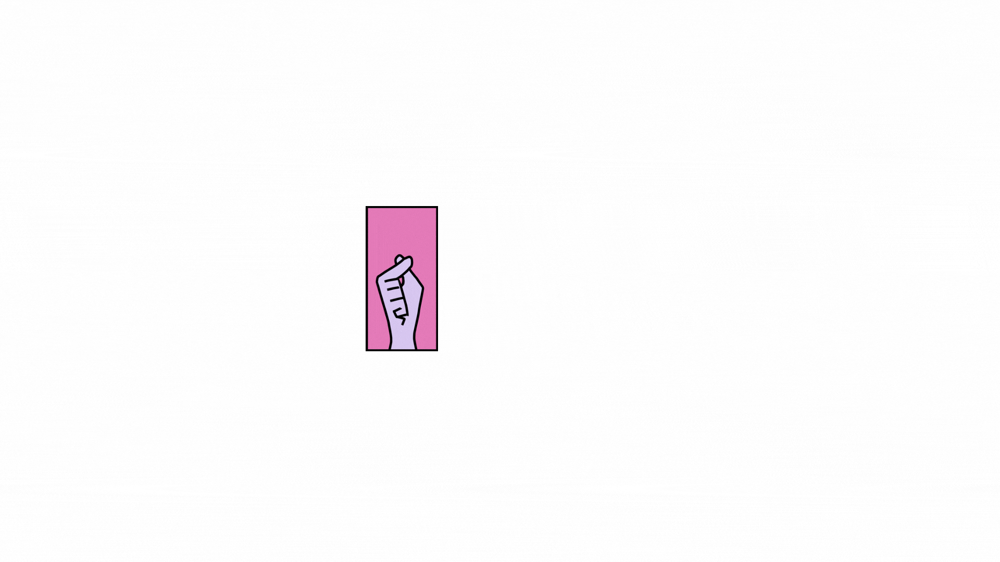
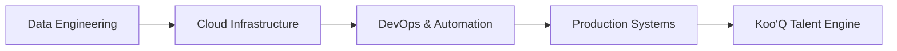

[](https://zhiming.tan/)

<p align="center">
  
</p>

<p align="center">
  <a href="https://kooq.my">
    
  </a>
  <a href="https://www.linkedin.com/in/zhimingtan/">
    
  </a>
  
</p>

---

## 👋 About Me

I'm **Zhi Ming Tan**, a Year 3 **Data Engineering student at Universiti Teknologi Malaysia (UTM)**.

I enjoy building systems that combine **data, cloud infrastructure, automation, and real-world product thinking**.

Currently, I am building **Koo'Q**, a talent verification engine that helps organizations discover high-potential students through competitions, events, achievements, and practical activities.

name: Zhi Ming Tan
focus: Data Engineering, Cloud, DevOps, Automation
cgpa: 3.98
university: Universiti Teknologi Malaysia
current_build: Koo'Q
previous_internship: Cloud Database Engineering Intern @ PETRONAS Digital


---

## 🚀 What I'm Building

<table>
<tr>
<td width="50%">

### 🔥 Koo'Q

A talent verification and opportunity matching ecosystem.

Koo'Q helps transform student activities, competitions, and achievements into meaningful talent data.

Instead of relying only on resumes, Koo'Q aims to help opportunities discover people through proof of action.

🌐 **Website:** [kooq.my](https://kooq.my)

</td>
<td width="50%">

### 🛠 Current Focus

* Building scalable data-driven systems
* Improving cloud and DevOps skills
* Designing better talent datasets
* Exploring event-driven architecture
* Preparing for 2u2i internship

</td>
</tr>
</table>

---

## 🧰 Tech Stack

<p align="center">


</p>

### Areas I’m Growing In

```text
Data Engineering     █████████░░
Cloud Infrastructure ████████░░░
Backend Development  ████████░░░
DevOps Automation    ███████░░░░
AI Product Building  ███████░░░░
```

---

## 🏆 Highlights

| Achievement                     | Details                                        |
| ------------------------------- | ---------------------------------------------- |
| 🥇 1st Place                    | Business Innovation Challenge                  |
| 🌏 International Representative | Represented UTM at 5th AJBIEX, Jakarta         |
| 🥇 Gold Award                   | National STEM Rocket Project                   |
| 🚀 Finalist                     | Microsoft AI Hackathon                         |
| 🏅 Consolation Prize            | National Micro Enterprise Pitching Competition |

---

## 📊 GitHub Snapshot

<p align="center">
  
  
</p>

<p align="center">
  
</p>

---

## 🎯 2026 Direction


```mermaid
flowchart LR
    A[Data Engineering] --> B[Cloud Infrastructure]
    B --> C[DevOps & Automation]
    C --> D[Production Systems]
    D --> E[Koo'Q Talent Engine]
```

---

## 🌍 Connect With Me

<p align="center">
  <a href="https://www.linkedin.com/in/zhimingtan/">
    
  </a>
  <a href="https://www.instagram.com/reynard0411">
    
  </a>
  <a href="https://kooq.my">
    
  </a>
</p>

---

<p align="center">
  <i>"Build systems that scale. Build products that matter."</i>
</p>

<p align="center">
  
</p>
```


[](https://www.linkedin.com/in/zhimingtan/)

[](https://www.instagram.com/reynard0411)

[](https://kooq.my)

---

> "Build systems that scale. Build products that matter."
